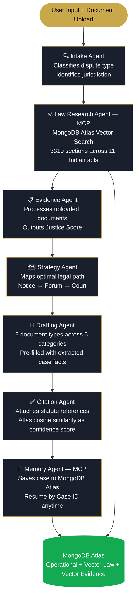

# CasePilot — India's AI Legal Case Worker

> *Not a legal chatbot. A legal case worker that fights alongside you.*

[](https://casepilot-34309631370.us-central1.run.app)
[](https://mongodb.com)
[](https://cloud.google.com)
[](https://deepmind.google/gemini)
[](LICENSE)

Built for the **Google Cloud Rapid Agent Hackathon — MongoDB Track**

---

## Demo

[](https://youtu.be/s9TJTEpafWk)

> Click to watch the full demo — 7 agents live, Justice Score, multi-document generation, and Resume Case feature.

🌐 **Live:** https://casepilot-34309631370.us-central1.run.app

---

## The Problem

1.3 billion Indians. Less than 1 lawyer per 1,000 people outside major cities. Legal fees that cost more than the dispute is worth. Complex processes designed for people who already understand the system.

When a landlord steals a deposit, when an employer withholds wages, when a government office ignores an RTI — most Indians have no idea what to do next.

**CasePilot changes that.**

---

## What It Does

Describe your legal problem in plain language. CasePilot's 7 AI agents investigate your case, search 3,310 sections across 11 Indian laws, score your evidence, map your legal path, and generate court-ready legal documents — in minutes, for free.

---

## Architecture


---

## The 7-Agent Pipeline

| Agent | Role |
|---|---|
| 🔍 Intake Agent | Classifies dispute type, identifies applicable jurisdiction |
| ⚖️ Law Research Agent | Semantic search across 3,310 law chunks via MongoDB Atlas Vector Search (MCP) |
| 📋 Evidence Agent | Analyses uploaded documents, outputs Justice Score |
| 🗺️ Strategy Agent | Maps optimal legal path (notice → forum → court) |
| 📝 Drafting Agent | Generates 6 document types across 5 dispute categories |
| ✅ Citation Agent | Attaches statute references with Atlas confidence scores |
| 💾 Memory Agent | Persists case record via MongoDB MCP Server, enables Resume Case |

---

## Justice Score

Every investigation produces a Justice Score — a deterministic case strength metric:

```json
{
  "case_strength": 82,
  "evidence_completeness": 75,
  "missing_items": ["vacating proof", "formal written notice"],
  "verdict": "Strong case — 2 critical gaps. Address before filing."
}
```

---

## Document Generation

6 document types generated based on dispute category:

| Dispute Type | Documents Generated |
|---|---|
| Landlord / Deposit | Legal Notice + Consumer Complaint + Affidavit |
| RTI Filing | RTI First Appeal + RTI Second Appeal |
| Workplace / Salary | Legal Notice + Police Complaint + Affidavit |
| Consumer | Consumer Complaint + Legal Notice |
| Cyber Crime | Police Complaint + Legal Notice |

---

## Resume Case Feature

Every case is saved to MongoDB Atlas with a unique Case ID (e.g. `CPA-20260605081047`). Users can return anytime, paste their Case ID, and resume exactly where they left off — full history, documents, and citations retrieved instantly.

---

## Knowledge Base

| Act | Chunks |
|---|---|
| Motor Vehicles Act | 690 |
| Indian Penal Code | 617 |
| Code of Criminal Procedure | 525 |
| Code of Civil Procedure | 252 |
| Transfer of Property Act 1882 | 250 |
| Consumer Protection Act 2019 | 214 |
| Information Technology Act 2000 | 211 |
| Negotiable Instruments Act | 190 |
| Indian Evidence Act | 184 |
| Right to Information Act 2005 | 113 |
| Industrial Disputes Act | 64 |
| **Total** | **3,310** |

---

## MongoDB Stack

| Layer | Collection | Purpose |
|---|---|---|
| Operational | `cases`, `documents`, `timelines` | Case management, generated docs |
| Vector Search | `law_corpus` | Semantic law retrieval (3,072 dims) |
| Vector Search | `evidence` | Per-user document embeddings |

Vector index: `law_vector_index` — cosine similarity, 3,072 dimensions (gemini-embedding-2)

**MongoDB MCP Server** powers the Law Research Agent and Memory Agent — giving agents native database access without raw queries.

---

## Tech Stack

- **Agents:** Google ADK (Agent Development Kit)
- **LLM:** Gemini 3.1 Flash-Lite
- **Embeddings:** gemini-embedding-2 (3,072 dimensions)
- **Database:** MongoDB Atlas (Operational + Vector Search)
- **MCP:** MongoDB MCP Server (npx mongodb-mcp-server)
- **Deployment:** Google Cloud Run
- **Frontend:** Vanilla HTML/CSS/JS (dark luxury theme)

---

## API
POST /case/new          → Analyse a new case (JSON or multipart with files)
GET  /case/{case_id}    → Resume a previous case
GET  /cases/recent      → List 10 most recent cases
GET  /health            → Health check

---

## Setup

```bash
git clone https://github.com/ssurekumar01111-hue/casepilot.git
cd casepilot
python -m venv venv
source venv/bin/activate  # Windows: venv\Scripts\activate
pip install -r requirements.txt
cp .env.example .env
# Fill in MONGODB_URI and GOOGLE_API_KEY in .env
python main.py                    # connection test
python scripts/ingest_corpus.py   # ingest law corpus into Atlas
python app.py                     # start API server
```

---

## What's Next

- WhatsApp Bot — voice message case filing in Hindi & English
- Regional Languages — Hindi, Tamil, Telugu, Bengali
- eCourts Integration — direct e-filing with India's eCourts portal
- Aadhaar Verification — verified profiles for stronger legal standing
- Lawyer Marketplace — connect to verified advocates
- Offline Mode — compressed corpus for rural low-connectivity areas
- MSME Platform — multi-tenant legal support for small businesses

---

## Disclaimer

CasePilot provides legal information only, not legal advice. Always consult a qualified advocate for your specific situation.

---

## License

Apache 2.0 — see [LICENSE](LICENSE)
